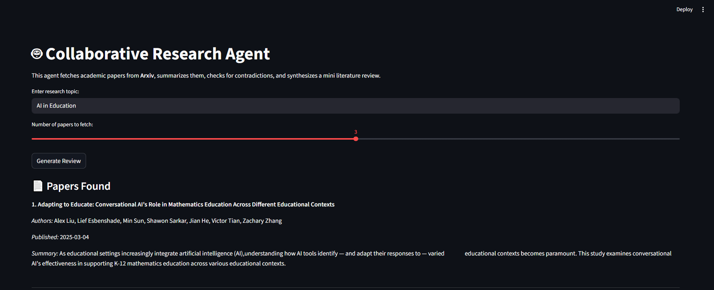
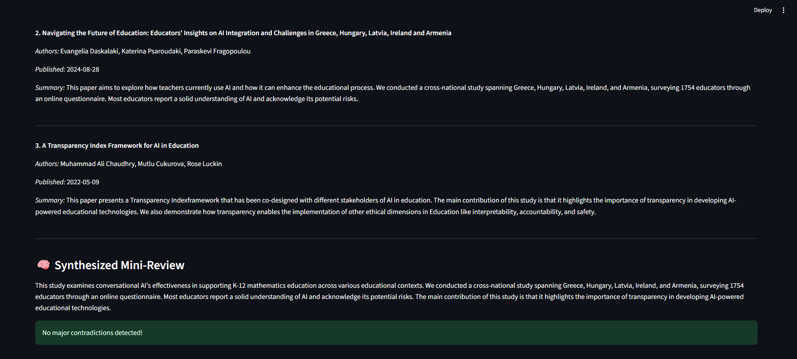
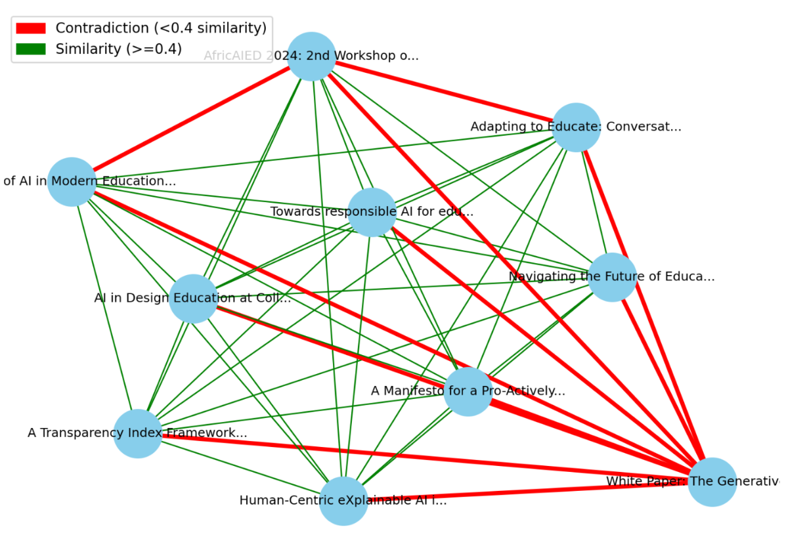

# Collaborative Research Agent

## Motivation

The rapid growth of academic literature makes it challenging for researchers to quickly synthesize information, spot contradictions, and gain a concise overview of any topic. This agent automates literature review by fetching papers from Arxiv, summarizing them, checking for contradictions, and visualizing relationships—helping researchers save time and make better decisions.

## Why This Works Better Than Others

- **Automated Summarization:** Uses advanced transformer models for concise, accurate summaries.
- **Contradiction Detection:** Highlights conflicting papers using semantic similarity.
- **Interactive Visualization:** Graphically shows relationships and contradictions for easy interpretation.
- **Dynamic Paper Selection:** Users can choose how many papers to analyze.
- **Streamlit UI:** Simple, interactive web interface.

## Features

- Fetches papers from Arxiv based on your query.
- Summarizes each paper using state-of-the-art NLP models.
- Detects contradictions and similarities between papers.
- Synthesizes a mini literature review.
- Visualizes relationships and contradictions in a network graph.
- Lets users select the number of papers dynamically.

## Installation & Setup

1. **Clone the repository:**
   ```
   git clone https://github.com/Virenbhalgamiya/Collaborative-Research-Agent.git
   cd collaborative_research_agent
   ```

2. **Create a virtual environment (recommended):**
   ```
   python -m venv venv
   venv\Scripts\activate   # On Windows
   ```

3. **Install dependencies:**
   ```
   pip install -r requirements.txt
   ```
   If you don't have a `requirements.txt`, install manually:
   ```
   pip install streamlit arxiv transformers sentence-transformers networkx matplotlib
   ```

4. **Run the app:**
   ```
   streamlit run app.py
   ```

5. **Open the browser:**  
   Go to the URL shown in the terminal (usually http://localhost:8501).

## Usage

- Enter your research topic.
- Select the number of papers to fetch.
- Click "Generate Review".
- View summaries, synthesized review, contradiction alerts, and the relationship graph.

## Example Results

### 1. Papers Fetched (result1.png)
Shows the list of papers fetched from Arxiv, including title, authors, publication date, and summary for each paper.


---

### 2. Synthesized Mini-Review (result2.png)
Displays the synthesized literature review generated from the summaries of all fetched papers.


---

### 3. Similarity & Contradiction Visualization (result3.png)
Shows the relationship graph. Each node is a paper, green edges indicate similarity, and red edges indicate possible contradictions.


---

## Notes

- Results depend on the input topic and available papers.
- Summaries and contradiction detection use transformer-based models for best accuracy.
- Visualization helps users quickly spot relationships and conflicts.

---

## License

MIT License

---

## Contact


For questions or suggestions, open an issue or contact virubhalgamiya@gmail.com.
